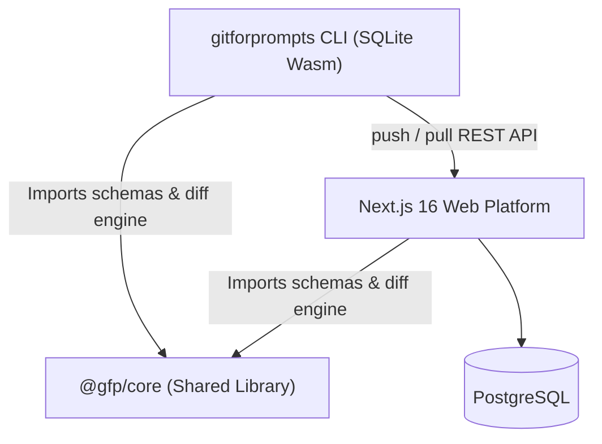

<!-- ╔══════════════════════════════════════════════════════════════════╗
     ║          GIT FOR PROMPTS — README                              ║
     ║          The Local-First Prompt Package Manager                ║
     ╚══════════════════════════════════════════════════════════════════╝ -->

<div align="center">

  # Git for Prompts

  ### *The local-first prompt package manager. Version, diff, and evaluate your AI prompts.*

  <br/>

  
  
  
  

  <br/>

  <a href="#-about-the-project">About</a> &nbsp;·&nbsp;
  <a href="#-features">Features</a> &nbsp;·&nbsp;
  <a href="#-gitforprompts-cli">CLI</a> &nbsp;·&nbsp;
  <a href="#-prompt-bundles">Prompt Bundles</a> &nbsp;·&nbsp;
  <a href="#-architecture">Architecture</a> &nbsp;·&nbsp;
  <a href="#-docker-self-hosting">Self-Hosting</a> &nbsp;·&nbsp;
  <a href="#-quickstart">Quickstart</a>

</div>

---

## 📌 About the Project

**Git for Prompts (`gitforprompts`)** is a **local-first prompt package manager & version control system** built for developers working with LLMs.

Most teams manage prompts in scattered Google Docs, Notion pages, or hardcoded strings deep in codebase repositories. When a prompt changes and an AI feature degrades, nobody knows who changed what, why, or how to roll back.

`gitforprompts` fixes this by providing:
1. **Local-first SQLite repository** — manage and version prompt bundles completely offline in your terminal (`.gitforprompts/`).
2. **Cloud Synchronization** — push local prompt bundles to the central cloud platform when you're ready to share or run hosted evaluations (`gitforprompts push` / `gitforprompts pull`).
3. **Structured Prompt Bundles** — version system prompts, user templates, model configs (provider, model, temperature, max tokens), tools, and response formats together as a single unit.

---

## ✨ Features

| Status | Feature | Description |
|:---:|---|---|
| ✅ | **Local-First SQLite** | `gitforprompts init` creates a Wasm-powered `.gitforprompts/` SQLite database right inside your project directory. 100% offline. |
| ✅ | **Prompt Bundles** | Version system prompt, user template, model settings (Groq, OpenAI, Anthropic, Ollama), tools, & structured response schemas. |
| ✅ | **Monaco Diff Engine** | Side-by-side visual comparison with line-level diffs and model config comparison header. |
| ✅ | **Cloud Sync (`push` / `pull`)** | `gitforprompts push <name>` and `gitforprompts pull <name>` seamlessly synchronize local SQLite state with cloud Postgres via REST API. |
| ✅ | **Automated Eval Runner** | Run evaluations against local or cloud prompt versions using custom test cases and AI scoring criteria. |
| ✅ | **Variable Interpolation** | Auto-detect `{{variable}}` placeholders in system & user prompts; inject at runtime via query params or CLI flags. |
| ✅ | **HMAC-Signed Webhooks** | Fire-and-forget `version.created` events with HMAC-SHA256 signature verification. |
| ✅ | **Agent-Ready & MCP** | Spec-compliant AcceptMarkdown (`Accept: text/markdown`), `/llms.txt`, and live Model Context Protocol (MCP) discovery at `/.well-known/mcp.json`. |
| ✅ | **OpenAPI 3.1 & CORS** | Public API specification at `/openapi.json` with permissive preflight CORS headers on `/api/v1/*`. |
| ✅ | **Security & Trust Anchors** | RFC 9116 `security.txt`, static `/about`, `/contact`, and `/privacy` trust pages, and IndexNow instant indexing protocol. |
| ✅ | **Docker Self-Hosting** | Spin up the full platform + PostgreSQL database offline with a single `docker compose up -d`. |

---

## 🖥️ `gitforprompts` CLI

The `gitforprompts` CLI is powered by an in-process Wasm SQLite engine (`sql.js`), enabling fast local operations without native build dependencies.

```bash
# Global installation
npm install -g gitforprompts

# Initialize a local prompt repository (.gitforprompts/ directory)
gitforprompts init

# Or run directly with zero install:
npx gitforprompts init

# Authenticate with your cloud account
gitforprompts auth gfp_live_your_key_here

# Create or commit a new prompt version locally
gitforprompts add "customer-support" -m "Adjusted temperature to 0.7 for tone"

# View local commit history
gitforprompts history customer-support

# Compare local versions
gitforprompts diff customer-support 1 2

# Add a test case and run evals locally
gitforprompts test-add customer-support -n "Greeting check" -i "Hi" -c "Polite tone"
gitforprompts run customer-support --provider groq

# Sync with Cloud
gitforprompts push customer-support         # Push local bundle -> Cloud
gitforprompts pull customer-support         # Pull latest cloud version -> Local
```

---

## 📦 Prompt Bundles

`gitforprompts` uses a structured JSON representation for prompt bundles defined in `@gfp/core`:

```json
{
  "systemPrompt": "You are a customer support agent for Acme Corp.",
  "userTemplate": "Issue reported by {{user_name}}: {{issue_description}}",
  "modelConfig": {
    "provider": "groq",
    "model": "llama-3.3-70b-versatile",
    "temperature": 0.7,
    "maxTokens": 1024
  },
  "tools": [],
  "responseFormat": { "type": "text" }
}
```

---

## 🏗️ Architecture & Monorepo Structure

`Git for Prompts` is organized as a pnpm workspace with clean separation of concerns:



```
Git-for-Prompts/
├── packages/
│   ├── core/                        # @gfp/core: Schemas, bundle types, diff engine, eval runner
│   └── cli/                         # gitforprompts: SQLite Wasm CLI (init, add, push, pull, run)
├── src/
│   ├── app/                         # Next.js 16 App Router (18 static routes + API routes)
│   │   ├── (dashboard)/dashboard/   # Overview, prompt detail, bundle editor, diff, evals, API keys, webhooks
│   │   ├── (landing)/               # Marketing landing page (force-static, sub-50ms edge caching)
│   │   ├── about/, contact/, privacy/ # Static trust anchor pages & security disclosures
│   │   ├── api/v1/                  # REST API endpoints & OpenAPI 3.1 specification (/api/v1/openapi.json)
│   │   ├── api/markdown/            # AcceptMarkdown content negotiation route
│   │   └── .well-known/             # MCP discovery manifest (mcp.json) & RFC 9116 security.txt
│   ├── components/                  # Bundle editor, Monaco diff viewer, feedback modal, ui-tokens
│   └── lib/                         # Server Actions, auth, webhooks, SSRF guard, rate limiting, DB client
├── Dockerfile                       # Multi-stage standalone build
└── docker-compose.yml               # Local Docker orchestrator (Postgres 16 + Next.js App)
```

---

## 🐳 Docker Self-Hosting

Run **Git for Prompts** completely self-hosted inside your infrastructure:

```bash
# 1. Clone repository
git clone https://github.com/kwakhare5/Git-for-Prompts.git
cd Git-for-Prompts

# 2. Set environment variables
export NEXT_PUBLIC_CLERK_PUBLISHABLE_KEY="your_key"
export CLERK_SECRET_KEY="your_secret"

# 3. Spin up application & database
docker compose up -d
```

Access your instance at `http://localhost:3000`.

---

## 🚀 Local Development Quickstart

### Prerequisites
- Node.js 22+
- pnpm 11+

### Setup

```bash
# 1. Clone & install dependencies
git clone https://github.com/kwakhare5/Git-for-Prompts.git
cd Git-for-Prompts
pnpm install

# 2. Configure environment
cp .env.example .env.local

# 3. Push database schema
pnpm drizzle-kit push

# 4. Start development server
pnpm dev
```

---

## 🧪 Testing

```bash
# Run unit & integration test suite (154 tests across 20 test files)
pnpm test

# Type-check entire workspace (0 errors)
npx tsc --noEmit

# Lint check (0 errors / 0 warnings)
pnpm lint
```

---

## 📄 License

MIT — see `LICENSE`.

<br/>

<div align="center">

  Made with ❤️ by [Karan Wakhare](https://github.com/kwakhare5)

  *"Treat your prompts as carefully as you treat your code."*

</div>
