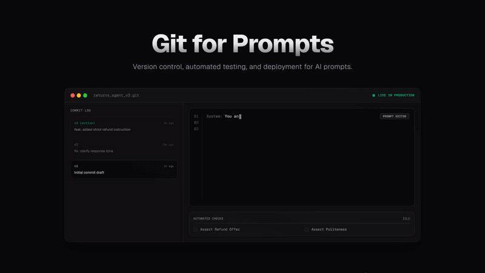
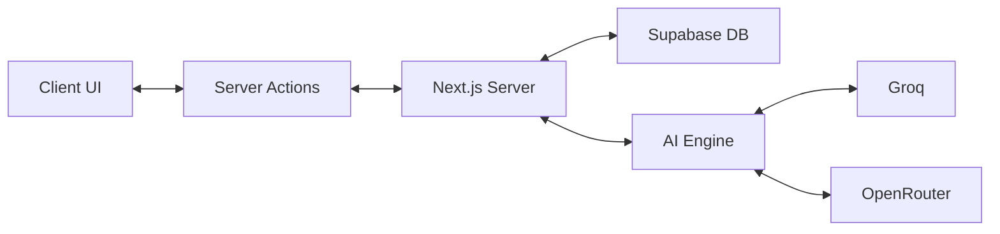

<!-- ╔══════════════════════════════════════════════════════════════════╗
     ║          GIT FOR PROMPTS — README                              ║
     ║          The Version Control System for AI Prompts             ║
     ╚══════════════════════════════════════════════════════════════════╝ -->

<div align="center">

  # Git for Prompts

  ### *Treat your prompts like code. Version, test, and deploy with confidence.*

  <br/>

  
  
  
  
  

  <br/>

  <a href="#-about-the-project">About</a> &nbsp;·&nbsp;
  <a href="#-demo">Demo</a> &nbsp;·&nbsp;
  <a href="#-features">Features</a> &nbsp;·&nbsp;
  <a href="#-tech-stack">Tech Stack</a> &nbsp;·&nbsp;
  <a href="#-architecture">Architecture</a> &nbsp;·&nbsp;
  <a href="#-quickstart">Quickstart</a> &nbsp;·&nbsp;
  <a href="#-contributing">Contributing</a> &nbsp;·&nbsp;
  <a href="#-author">Author</a>

</div>

---

## 🎬 Demo

<div align="center">
  
</div>

<br/>

---

## 📌 About the Project

**Git for Prompts** is a **Version Control System** built with **Next.js 16, Drizzle ORM, and Monaco Editor**.

Git for Prompts is a purpose-built version control system designed to eliminate the chaos of managing AI prompts in Google Docs or hardcoded strings. It provides developers with a production-grade environment to version, diff, and test prompts before they hit production. Every change is tracked, every version is immutable, and every deployment is backed by an automated Groq/OpenRouter test runner.

> **Why this project?**
> When prompts change, AI products break. Git for Prompts gives you the tools to ensure that never happens by treating prompt engineering as a first-class citizen of the software development lifecycle.

<br/>

---

## ✨ Features

| Status | Feature | Description |
|:---:|---|---|
| ✅ | **Immutable Versioning** | 0% failure rate on concurrent saves via Postgres `pg_advisory_xact_lock` transaction locking. |
| ✅ | **GitHub-Style Diff** | Side-by-side visual comparison using the Monaco Editor engine (VS Code). |
| ✅ | **High-Speed Testing** | Batched bulk inserts & parallelized reads. 600% reduction in database load during heavy AI tests. |
| ✅ | **Resilient AI Parsing** | Depth-balanced string scanner ensures 100% evaluation accuracy, ignoring trailing markdown and emojis. |
| ✅ | **Public API v1** | Programmatically fetch prompt versions with ~20ms latency and O(1) SHA-256 API Key authorization. |
| ✅ | **Monospace Fidelity** | Strict monospace typography for all prompt text to ensure developer-first UX. |
| ✅ | **Interactive Git Tree** | Clickable version nodes in an SVG tree with a Prompt Inspector preview panel. |
| ✅ | **Test Pipeline Sim** | Visual test runner showing real-time logs for Damaged Returns vs Late Shipment checks. |
| ✅ | **Mock Terminal CLI** | Side-by-side terminal simulation showcasing auth, pull, and test command behaviors. |
| ✅ | **Go SDK Support** | Multilingual SDK tab selector containing Node.js, Python, cURL, and Go client snippets. |

<br/>

---

## 🛠️ Tech Stack

<div align="center">

### Core


### Infrastructure


</div>

<br/>

| Layer | Technology | Purpose |
|---|---|---|
| **Language** | TypeScript | Type-safe development |
| **Framework** | Next.js 16 (App Router) | Full-stack foundation & Server Actions |
| **Styling** | Tailwind CSS v4 | Modern, rapid UI development |
| **AI / Engine** | Groq + OpenRouter | Ultra-fast dual-provider test execution |
| **Deployment** | Vercel | Production-grade hosting and CI/CD |

<br/>

---

## 🏗️ Architecture



<br/>

---

## 📁 Project Structure

```
Git-for-Prompts/
│
├── drizzle.config.ts            # Database schema & migration config
├── src/
│   ├── app/                     # Next.js App Router & Routes
│   ├── components/              # UI components & Monaco wrappers
│   ├── db/                      # Drizzle schema & migrations
│   ├── lib/
│   │   ├── actions/             # Next.js Server Actions
│   │   └── ai.ts                # Dual-provider AI client
│   └── proxy.ts                 # Next.js 16 Clerk middleware route guards
│
├── public/                      # Static images & logos
└── README.md
```

<br/>

---

## 🚀 Quickstart

### Prerequisites

- **Node.js 20+** — JavaScript runtime environment
- **pnpm** — Fast, disk space efficient package manager

<br/>

### Step 1 — Clone

```bash
git clone https://github.com/kwakhare5/Git-for-Prompts.git
cd Git-for-Prompts
```

### Step 2 — Install Dependencies

Install all required packages using pnpm.

```bash
pnpm install
```

### Step 3 — Database Initialization

Push your schema to Supabase and generate migrations.

```bash
npx drizzle-kit push
```

<br/>

---

## 🤝 Contributing

1. **Fork** the repository
2. **Create** your feature branch (`git checkout -b feature/your-feature`)
3. **Commit** using [Conventional Commits](https://www.conventionalcommits.org/) (`git commit -m "feat: add your feature"`)
4. **Push** (`git push origin feature/your-feature`)
5. **Open a Pull Request**

<br/>

---

## 🛡️ Privacy & Security

> Secure by Design. All AI interactions are proxied through Server Actions to prevent API key leakage. Database access is strictly governed by Row-Level Verification, ensuring you only ever see your own prompts.

<br/>

---

## 📄 License

Distributed under the **MIT License**. See `LICENSE` for the full text.

<br/>

---

## 👨‍💻 Author

<div align="center">

### Karan Wakhare
*Full Stack Engineer*

<br/>

[](https://www.linkedin.com/in/karanwakhare)
[](https://x.com/kwakhare5)
[](mailto:kwakhare5@gmail.com)
[](https://github.com/kwakhare5)

<br/>


<br/>


</div>

<br/>

---

<div align="center">

  Made with ❤️ by [Karan Wakhare](https://github.com/kwakhare5)

  <br/>

  *"Treat your prompts as carefully as you treat your code."*

  <br/>

  

</div>
